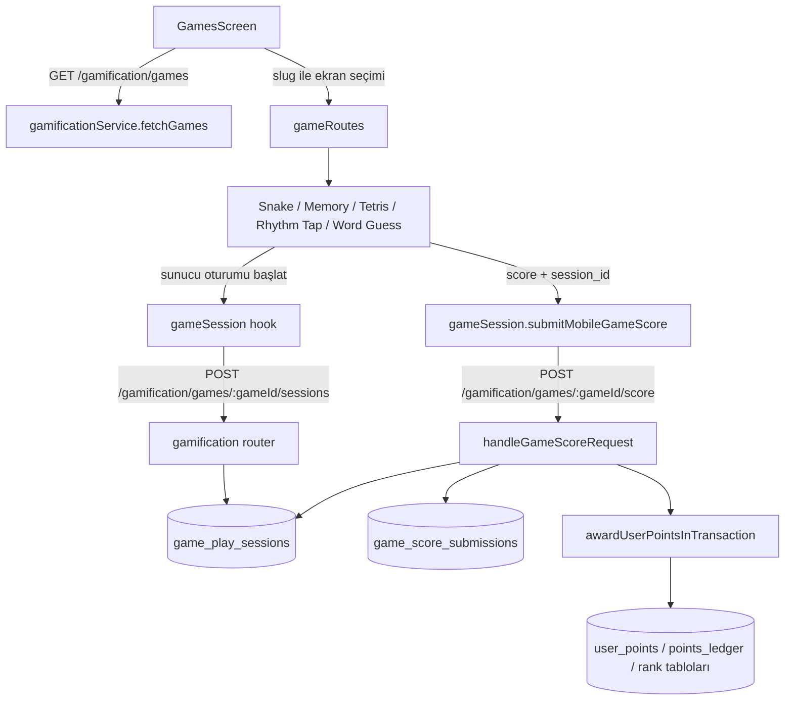

# Games akışı ve kod bağlantıları

Bu belge mobil uygulamadaki oyun listesinden skor ve puan kaydına kadar Games özelliğinin hangi dosyalara ve servislere bağlandığını açıklar. Kod değiştirmek veya silmek için talimat değildir.

## Kısa akış

## Mobil taraf

### Oyun listesi ve ekrana geçiş

- [GamesScreen.tsx](../mobile/src/screens/GamesScreen.tsx) `fetchGames()` ile backend’deki aktif oyun kayıtlarını ve market öğelerini yükler. Oyun seçilince slug üzerinden ekran adına karar verir ve oyunun nesnesini route parametresi olarak taşır.
- [gameRoutes.ts](../mobile/src/screens/games/gameRoutes.ts) desteklenen slug eşleşmelerini tutar: `snake`, `memory`, `tetris`, `rhythm-tap`, `word-guess`.
- Oyunlar ayrıca mobil uygulamada yerleşik tanımlıdır. Games ekranı backend’de slug kaydı bulursa gerçek oyun UUID’sini kullanır; bulamazsa `builtin:<slug>` biçiminde yerel bir ID ile oyunu yine listeler. Bu yerel ID, backend’in UUID bekleyen oturum endpoint’inde geçerli değildir. Oyun ekranı açılır ama sunucu oturumu başlatılamaz ve skor kaydedilemez. Puanlı kullanım için `arcade_games` tablosunda o slug’a ait aktif kayıt bulunmalıdır.
- [RootNavigator.tsx](../mobile/src/navigation/RootNavigator.tsx) `Games` ekranını ve beş oyun ekranını navigation stack’e kaydeder.

### Ortak oturum ve skor istemcisi

- [gameSession.ts](../mobile/src/screens/games/gameSession.ts) `useServerGameSession(gameId)` hook’unu sağlar. Ekran açıldığında ve her yeni turda `startGamePlaySession` çağırır; dönen `session.id` değerini ref ve beklenen Promise içinde tutar. `ready` oturum hazır olmasını, `failed` başlatmanın başarısız olmasını gösterir.
- Aynı dosyadaki `submitMobileGameScore` istemcide hesaplanmış skoru aşağı yuvarlayıp `{ score, session_id }` olarak gönderir. Tur kimliği veya süre artık istemciden gönderilmez.
- [gamificationService.ts](../mobile/src/services/gamificationService.ts) gerçek HTTP çağrılarını yapar: oyun kataloğu `GET /gamification/games`, oturum açma `POST /gamification/games/:gameId/sessions`, skor gönderme `POST /gamification/games/:gameId/score`.
- Bütün bu istekler ortak `api` istemcisini ([api.ts](../mobile/src/services/api.ts)) kullanır; kimlik doğrulama başlığı ve API temel URL’si bu katmandan gelir.
- [GameChrome.tsx](../mobile/src/screens/games/GameChrome.tsx) oyunların ortak sonuç penceresini gösterir. Skor gönderimi başarısızsa yeniden gönderme eylemini çağırır; yeni tur eylemi ilgili oyun ekranının reset fonksiyonunu çağırır.

### Oyun ekranları ve skor hesabı

Beş ekran da oyunun yerel durumunu ve skoru kendi içinde hesaplar. Backend’e oyun hamlelerini, kart seçimlerini veya dokunma zamanlarını göndermez.

| Dosya | Oyun/ekran adı | İstemcideki skor yaklaşımı |
|---|---|---|
| [SnakeScreen.tsx](../mobile/src/screens/games/SnakeScreen.tsx) | Snake | Yiyecek alındığında combo’ya göre puan ekler. |
| [MemoryGameScreen.tsx](../mobile/src/screens/games/MemoryGameScreen.tsx) | Hafıza kartları | Eşleşen kart, hamle sayısı ve combo ile skoru hesaplar. |
| [TetrisScreen.tsx](../mobile/src/screens/games/TetrisScreen.tsx) | Bloklar | Parça kilitlenince taban puan; temizlenen satır sayısına göre ek puan verir. |
| [RhythmTapScreen.tsx](../mobile/src/screens/games/RhythmTapScreen.tsx) | Ritim Tap | İstemcinin ölçtüğü dokunma gecikmesine ve seri sayısına göre Perfect/Good puanı verir. |
| [WordGuessScreen.tsx](../mobile/src/screens/games/WordGuessScreen.tsx) | Şarkı tahmini | Doğru cevap ve seri sayısına göre puanı hesaplar. |

Memory, Rhythm Tap, Tetris ve Word Guess giriş/timer akışını sunucu oturumu hazır olana kadar bekletir. Snake’in hareket interval’i `ready` değerini kontrol etmiyor; oturum isteği yavaşsa oyun sunucu oturumu gelmeden ilerleyebilir. Bu, kaynakta gözlenen mevcut davranıştır.

## Backend tarafı

- [gamification.ts](../backend/src/routes/gamification.ts) önce `router.use(authMiddleware)` uygular. Yani bu Games endpoint’leri oturum açmış kullanıcı kimliğiyle çalışır.
- `POST /games/:gameId/sessions` ve `POST /games/:gameId/score` yolları `writeRateLimit` arkasındadır. İki handler da misafir hesabı reddeder; skor ve puan için kayıtlı hesap gerekir.
- Oyun kataloğu `GET /games`, `arcade_games` tablosundaki `is_active = true` kayıtlarını döndürür.
- Oturum başlatma handler’ı game ID’yi UUID olarak doğrular, oyunun aktif olmasını ister ve `game_play_sessions` içine kullanıcıya ve oyuna bağlı bir kayıt ekler. Başlangıç zamanı veritabanından alınır, oturum iki saat sonra sona erer.
- Skor handler’ı strict `{ score, session_id }` gövdesi kabul eder. Skor tam sayı ve 0–1.000.000 aralığında; oturum ID’si UUID olmalıdır. Oturumun aynı kullanıcıya ve oyuna ait, süresi dolmamış ve daha önce kullanılmamış olmasını transaction içinde `FOR UPDATE` ile kontrol eder.
- Oynama süresini istemciden almaz; `started_at` ile veritabanındaki `NOW()` farkını kullanır. Bir saniyeden kısa veya iki saatten uzun oturum reddedilir. Oturum, skor yazma işlemiyle birlikte tüketilir.
- Günlük ödül limiti ve puan oranı aktif oyun kaydından okunur. Gün içinde daha önce verilen oyun puanları düşüldükten sonra bu tur için verilecek puan hesaplanır.
- `awardUserPointsInTransaction` ([gamification.ts service](../backend/src/services/gamification.ts)) aynı transaction içinde bakiye, ledger, rank skoru ve aylık rank skorunu günceller.

## Veritabanı bağlantıları

- `arcade_games`: oyun kataloğu, slug, başlık, aktiflik, puan oranı ve günlük limit.
- `game_play_sessions`: kullanıcı/oyun oturumları; `started_at`, `expires_at`, `submitted_at` alanları sunucu zamanını ve tek kullanımı takip eder.
- `game_score_submissions`: gönderilen skor, verilen puan, sunucu süresinden türetilen `play_duration_ms`, `server_session` kaynağı ve `session_id` saklanır.
- `idx_game_score_session_once`, bir oturumla birden fazla skor kaydı oluşturulmasını engeller. Eski `client_round_id` alanı oturum ID’siyle de doldurulur ve onun için de kısmi unique index bulunur.
- `user_points` ve `points_ledger`: güncel puan bakiyesi ile puan hareketlerinin kaydı.
- `users.rank_score` ve `user_monthly_rank_scores`: puan ödülü verildiğinde güncellenen sıralama değerleri.
- Bu tabloların tanımları [schema.sql](../backend/src/db/schema.sql) içindedir. Kodun şemayı değiştirmesi, kurulu bir veritabanına değişikliğin uygulandığı anlamına gelmez; hedef veritabanındaki migration durumu ayrıca kontrol edilmelidir.

## Güvenlik ve davranış sınırları

- Sunucu oturumu kullanıcı/oyun bağını, süreyi, sona ermeyi ve aynı oturumun tekrar kullanılmasını denetler.
- Skorun doğruluğunu denetlemez. İstemci skor değeri gönderdiğinden, değiştirilmiş bir istemci uygun oturuma keyfi bir skor yazmayı deneyebilir; skor için sunucu tarafında oyun kuralı/hamle doğrulaması bu akışta yoktur.
- Mobil taraf başarısız HTTP yanıtından sonra aynı oturum ID’siyle tekrar gönderim yapar. Sunucu ilk isteği commit ettiği halde yanıt istemciye ulaşmadıysa, tekrar istek oturumu kullanılmış bulup 409 alabilir. Şu an bu durumda önceki başarılı sonucu idempotent şekilde geri döndüren bir mekanizma görünmüyor.
- `builtin:<slug>` yedek ID’leri sadece listeleme/görüntüleme için kullanılabilir; puanlı oturum başlatmak için veritabanında gerçek UUID’ye sahip aktif oyun kaydı gerekir.

## Bağlantılı uç noktalar

Kanonik prefix `/api/v1` olduğundan mobilin kullandığı tam yollar:

- `GET /api/v1/gamification/games`
- `POST /api/v1/gamification/games/:gameId/sessions`
- `POST /api/v1/gamification/games/:gameId/score`

Oturum açma ve skor gönderme yeni oyun başlatmak/kaydetmek için; oyun kataloğu ise Games listesini doldurmak için kullanılır. Market kartları aynı ekranda görünse de bu üç oyun oturumu endpoint’inin dışında ayrı API akışıdır.
